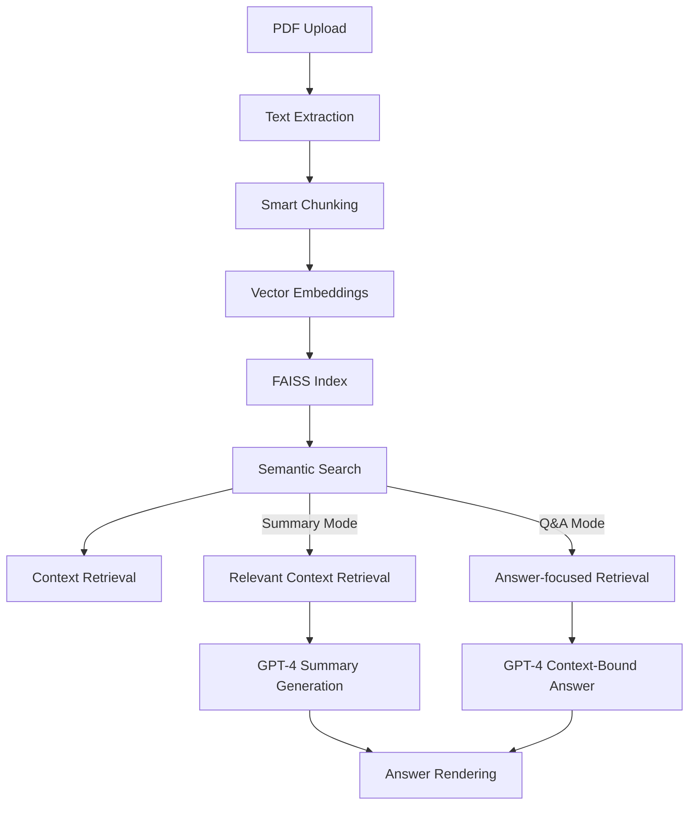

# RAG-Powered Document Assistant

##  Quick Start Guide

### Prerequisites

- Python 3.8 or higher
- OpenAI API key ([Get yours here](https://platform.openai.com/api-keys))

### 1️ **Clone & Install**

```bash
git clone https://github.com/ek-sai/RAG_PDF_Summarizer.git
pip install -r requirements.txt
```

** Create a `.env` file**
```
OPENAI_API_KEY=your-api-key-here
```

### 3️ **Launch the App**

```bash
streamlit run app.py
```
 **That's it!** Your app will open at `http://localhost:8501`

---

##  How to Use

### **Step 1: Upload Your PDFs** 
- Drag and drop your PDF files into the sidebar
- Support for multiple PDFs at once

** Choose a Mode**
**Mode 1: Summary Generator**

### ** Choose Your Summary Style** 
- **Comprehensive**: Detailed, thorough analysis
- **Brief**: Quick 2-3 paragraph overview  
- **Bullet Points**: Key insights in list format
- **Executive**: Decision-focused summary

### ** Optional Topic Focus** 
- Enter a specific topic or question
- Get laser-focused summaries on exactly what you need

** Mode 2: Ask Questions (Q&A Mode)**

**Ask questions about anything inside your PDF:**

Examples:

“What is the test date?”

“What are abnormal values?”

“What was the conclusion of the survey?”

### **Step 4: Generate & Download** 
- Click "Generate RAG Summary"
- Download your summary with metadata

---

## Technical Architecture



